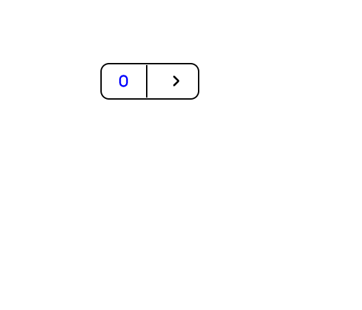
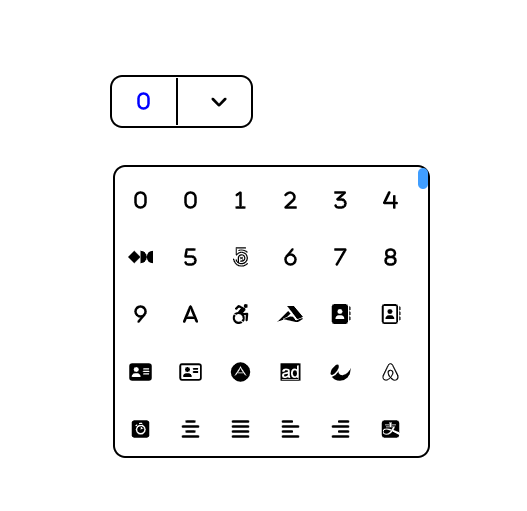
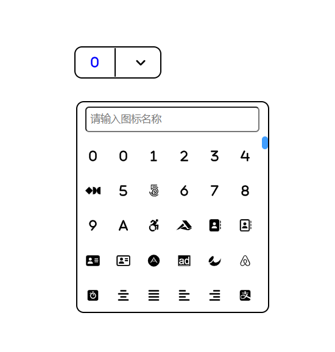
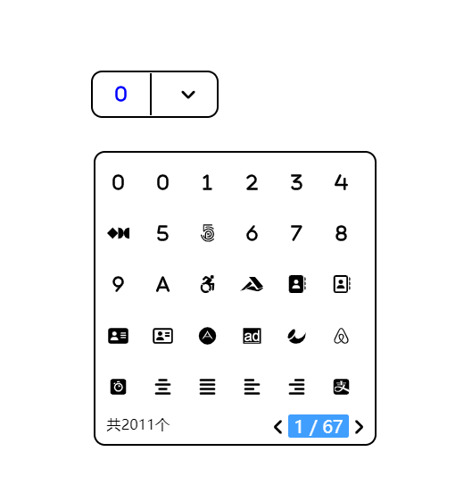
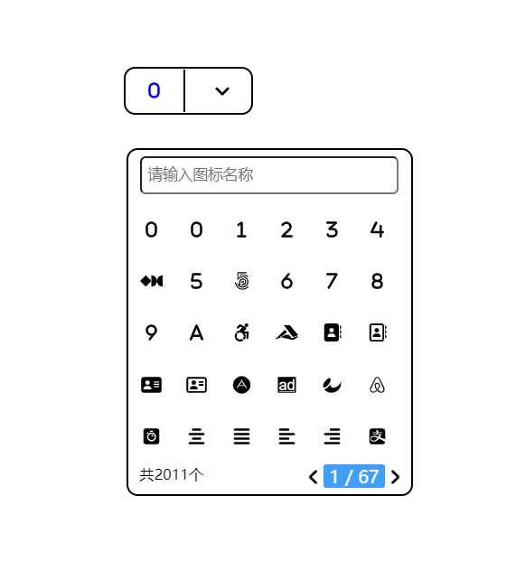

# fontawesome-icon-pulings
# 图标选择插件
#### 介绍
fontawesome图标选择插件，使用fontawesome官方图标库，共有2011个图标，可直接放入网站只需要引入js和css文件,第一个版本功能基本完善，以后的版本会继续优化。

#### 使用说明

html调用
```js
<!-- html引入以下内容  -->
<div class="fate-iconcheck-content" data-search="false" data-page="true">
	<input type="text" name="icon" class="hide"/>
</div>
<!-- 
data-search:搜索框开启
data-page:开启分页模式

true:开启
false:关闭

图标数据在json文件夹IconData.json中,默认使用的是本地数据，如果想使用在线链接，可在fate-icon-pulings.js中找到json/IconData.json进行更换
 -->

```
### 预览图





#### 
觉得有用给个赞把！

